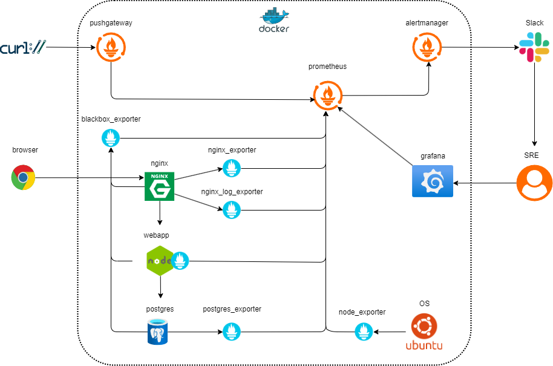

# テックウルトフライデーナイト vol.1 ハンズオン資料

## Prometheus + Grafana でモニタリングを体験する

## 概要図



### 環境構築

Dockerコンテナを使用して、Prometheusの監視環境を構築する。

1. GitHubからリソース取得

```bash
# リポジトリクローン
$ git pull https://github.com/tech-ult/tufn-202504.git
$ cd tufn-202504
```

2. SLACKの通知先設定

[alertmanager/alertmanager.yml](alertmanager/alertmanager.yml) の `slack_api_url` に、自身のSLACK_APIエンドポイントを設定する。

また、receiversの `channel` に、通知先のチャネル名を指定する。

```YAML
  # Slackの設定（SlackのIncoming Webhook URLを設定）
  slack_api_url: 'https://hooks.slack.com/services/XXXXXXXXXX/XXXXXXXXXXX/XXXXXXXXXXXXXXXXXXXXXXj'

: 途中省略

  slack_configs:
  - channel: '#alert'
```

3. コンテナのビルドと起動

```bash
# nginxとwebappのコンテナビルド
$ docker compose build --no-cache
# コンテナ立ち上げ
$ docker compose up -d
# 12プロセス起動確認
$ docker ps
CONTAINER ID   IMAGE                                                   COMMAND                  CREATED         STATUS         PORTS                                                                      NAMES
47fdacd65f02   tufn-202504-nginx                                       "bash -c '/usr/local…"   3 minutes ago   Up 3 minutes   0.0.0.0:80->80/tcp, :::80->80/tcp, 0.0.0.0:443->443/tcp, :::443->443/tcp   nginx_server
87675b95eaa4   tufn-202504-webapp                                      "docker-entrypoint.s…"   3 minutes ago   Up 3 minutes   0.0.0.0:3001->3001/tcp, :::3001->3001/tcp                                  nodejs_webapp
c84a224d02be   nginx/nginx-prometheus-exporter:latest                  "/usr/bin/nginx-prom…"   3 days ago      Up 3 minutes   0.0.0.0:9113->9113/tcp, :::9113->9113/tcp                                  nginx_exporter
774549c9a274   quay.io/martinhelmich/prometheus-nginxlog-exporter:v1   "/prometheus-nginxlo…"   3 days ago      Up 3 minutes   0.0.0.0:9114->4040/tcp, [::]:9114->4040/tcp                                nginx_log_exporter
39a6d8c65550   grafana/grafana                                         "/run.sh"                3 days ago      Up 3 minutes   0.0.0.0:3000->3000/tcp, :::3000->3000/tcp                                  grafana
c94f40524ed5   prometheuscommunity/postgres-exporter                   "/bin/postgres_expor…"   3 days ago      Up 3 minutes   9187/tcp                                                                   postgres_exporter
29356d0e014b   prom/prometheus                                         "/bin/prometheus --c…"   3 days ago      Up 3 minutes   0.0.0.0:9090->9090/tcp, :::9090->9090/tcp                                  prometheus
ccc500225e63   prom/blackbox-exporter                                  "/bin/blackbox_expor…"   3 days ago      Up 3 minutes   0.0.0.0:9115->9115/tcp, :::9115->9115/tcp                                  blackbox_exporter
b9718554216e   prom/pushgateway                                        "/bin/pushgateway"       3 days ago      Up 3 minutes   0.0.0.0:9091->9091/tcp, :::9091->9091/tcp                                  pushgateway
db4695df292e   postgres:latest                                         "docker-entrypoint.s…"   3 days ago      Up 3 minutes   0.0.0.0:5432->5432/tcp, :::5432->5432/tcp                                  postgres_server
8826844bc605   prom/alertmanager                                       "/bin/alertmanager -…"   3 days ago      Up 3 minutes   0.0.0.0:9093->9093/tcp, :::9093->9093/tcp                                  alertmanager
124f28d4265d   prom/node-exporter                                      "/bin/node_exporter …"   3 days ago      Up 3 minutes   0.0.0.0:9100->9100/tcp, :::9100->9100/tcp                                  node_exporter
```

### Dockerコンテナ毎の役割

|No.|コンテナ名|役割|
|:--|:--|:--|
|1|prometheus|Prometheus 本体|
|2|grafana|Visualization の Grafana|
|3|nginx_server|Nginx Web Server|
|4|nodejs_webapp|Node.js App Server|
|5|postgres_server|PostgreSQL DB Server|
|6|pushgateway|Pushgateway。短命JOBがメトリクスをPushする。|
|7|alertmanager|Alertmanager。Prometheusから受信したアラートを通知先に送信する。|
|8|node_exporter|ノードのCUP使用率等のメトリクスを収集する。|
|9|nginx_exporter|Nginxの接続数等を収集する。|
|10|nginx_log_exporter|Nginxのアクセスログをもとにステータスコード等のメトリクスを収集する。|
|11|postgres_exporter|PostgreSQLのスロークエリ等のメトリクスを収集する。|
|12|blackbox_exporter|外形監視でサービスの生存確認やエンドポイントごとのレイテンシー等のメトリクスを収集する。|

